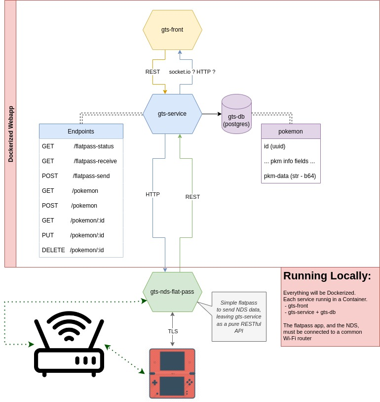

# gts-cloning-machine
A cloning machine, using the GTS (Global Trade System).
-

---

# Goals, fo far

 - ### v1.0.0
  - ##### Run everything locally (Dockerized)
    - [x] gts-service
    - [x] gts-db
    - [ ] gts-nds-flatpass
  - ##### Create a fully working Cloning Machine
    - [x] works almost like the GTS
    - [x] persists uploaded Pokemon infos in a local DB
    - [x] download Pokemons from the local DB's Pokemon infos
    - [x] uses a readble frontend, to make life easier (cf gts-front/README.md)
  - ##### Handle Gen 4 and 5
    - [x] Gen 4
    - [ ] Gen 5

 - ### v2.0.0
  - ##### Run everything on hosted servers
    - [ ] gts-service
    - [ ] gts-db
    - [ ] gts-nds-flatpass
  - ##### Be able to handle multiple users
    - [ ] handle user login
    - [ ] persists them with user_id
    - [ ] handling them with cartrige_id, nds_id or nds_mac_addr, to segregate every pokemon upload/download
  - ##### (if possible) Get rid of gamestat/pokemonclassic servers
    - [ ] recreacting their behaviour

