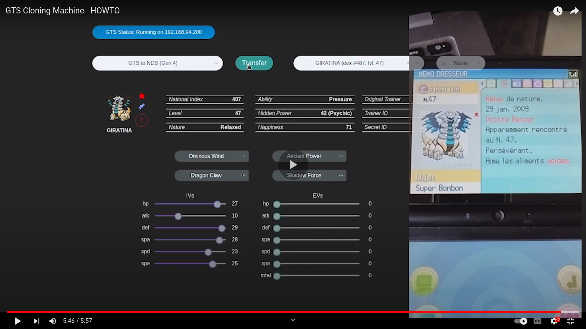

# gts-cloning-machine (version=0.3.0)
A cloning machine, using the GTS (Global Trade System).
---

# What is it ?

A Fake GTS server, with a user friendly web User Interface (on http://localhost:8080):
 - it interacts with your Gen 4 Pokemon Cartridge (DPPt, HGSS), on your Nintendo DS
 - you can read Pokemon data and secret data (Secret ID, IVs, EVs, Hidden Power...)
 - you can trade Pokemon:
   - from your Nintendo DS to the Fake GTS
   - from the Fake GTS to your NDS, as many times as you want (that's how you can actually clone Pokemon)

For now, it runs on Linux, and Mac OSX, and it can run on Windows (not tested yet though).
Only the interface is user friendly, but the hole running exerience, is not the best user experience (requiring to run back-end in a Terminal).

Soon, everything will be easier to use for anyone !

# Why is it

As I'm shiny hunting in Gen 4 (and completing my shinydex),
I want to send Pokemon to the newest generations, but I also want to keep Pokemon in my Gen 4 cartridges.

Hence, cloning was the solution, but on Gen 4, cloning only works on Diamond and Platinum, using the GTS.
Unfortunately, official GTS servers are down, and the cloning method can often be tricky, taking up to an hour of unsuccessful tries, to clone a single Pokemon.

Some tools already exist (IR-GTS for example, which was the base of my project),
but the interfaces are not user friendly, therefore, I wanted to add a better user experience !

# HOW-TO:

- Prerequisites:
  - Install Docker (https://docs.docker.com/engine/install/)
  - Install Python 2.7 and 3 (https://datascience.com.co/how-to-install-python-2-7-and-3-6-in-windows-10-add-python-path-281e7eae62a)

- Run instructions (just watch the video below, but I also write them down here):
  - Create and turn on a WiFi hotspot:
    - it can be your phone, your WiFi router...
    - set it to WEP security, or No Security (the easiest choice)
  - Connect your computer to the WiFi hotspot:
  - Open 2 Terminals on your computer:
    - In the first one, execute `gts-cloning-machine/app/run`
    - In the second one, execute `gts-cloning-machine/app/gts-nds-flat-pass/flat-pass`
  - Go to http://localhost:8080, in your preferred web browser
  - Modify the CWF settings, in your Gen 4 Pokemon Game:
    - update preferred DNS adress (set it to the address shown in the blue badge: GTS status: Running on xx.xx.xx.xx)
    - test the connection, and save theses parameters
  - Have fun !
    - if you have some problems, notes, you can open issues for this repository
    - feel free to open pull requests

---

# Architecture

---

# Goals, fo far

 - ### v1.0.0
  - ##### Run everything locally (Dockerized)
    - [x] gts-service
    - [x] gts-db
    - [x] gts-event-manager
    - [ ] gts-nds-flatpass
  - ##### Create a fully working Cloning Machine
    - [x] works almost like the GTS
    - [x] persists uploaded Pokemon infos in a local DB
    - [x] download Pokemons from the local DB's Pokemon infos
    - [x] uses a readble frontend, to make life easier (cf gts-front/README.md)
  - ##### Handle Gen 4 and 5
    - [x] Gen 4
    - [x] Gen 5

 - ### v2.0.0
  - ##### Run everything on hosted servers
    - [ ] gts-service
    - [ ] gts-db
    - [ ] gts-event-manager
    - [ ] gts-nds-flatpass
  - ##### Be able to handle multiple users
    - [ ] handle user login
    - [ ] persists them with user_id
    - [ ] handling them with cartrige_id, nds_id or nds_mac_addr, to segregate every pokemon upload/download
  - ##### (if possible) Get rid of gamestat/pokemonclassic servers
    - [ ] recreacting their behaviour
