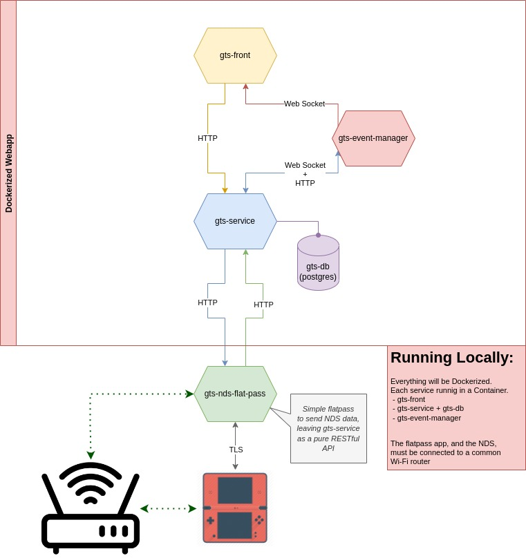

# gts-cloning-machine
A cloning machine, using the GTS (Global Trade System).
-


---

# Goals, fo far

 - v1.0.0
```
 - Run everything locally (Dockerized)
 - Create a fully working Cloning Machine
   -> works almost like the GTS
   -> persists uploaded Pokemon infos in a local DB
   -> download Pokemons from the local DB's Pokemon infos
   -> uses a readble frontend, to make life easier (cf gts-front/README.md)
 - Handle Gen 4 and 5
```
 - v2.0.0
```
 - Run everything on hosted servers
 - Be able to handle multiple users
   -> persists them with user_id
   -> handling them with cartrige_id, nds_id or nds_mac_addr,
      to segregate every pokemon upload/download
 - Get rid of gamestat/pokemonclassic servers (if possible) -> by recreacting their behaviour
```
