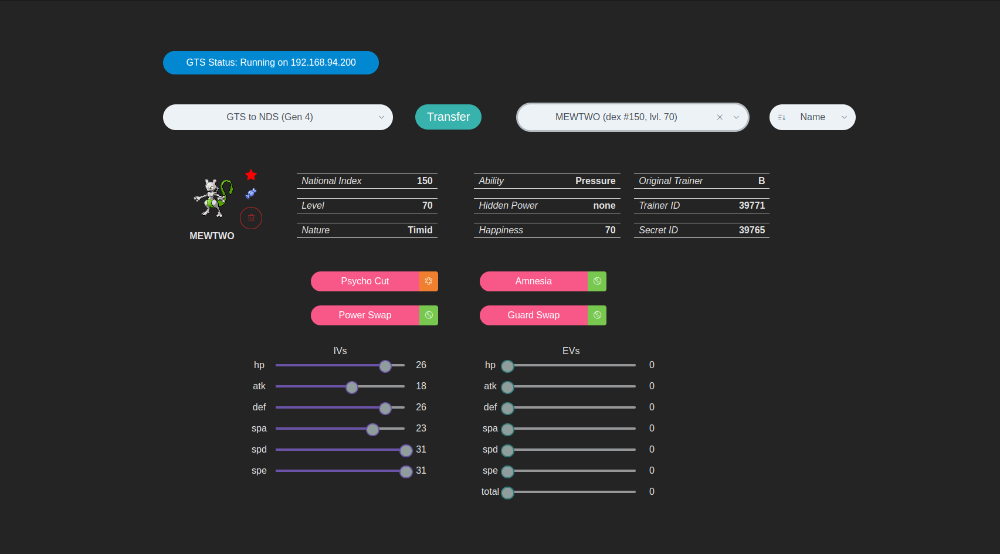

# GTS-FRONT
Frontend interface for the GTS service.

---

Mostly, it should receive data from the NDS, and send them, updated to it.

Eventually it must:
 - receive data events from the GTS service (using socket.io, or pure rest requests)
 - send data to the GTS service (rest request)

Flow:
 - sending pokemon to GTS:   NDS > gts-flat-pass > gts-service > gts-front
 - receive pokemon from GTS: gts-front > gts-service > gts-flat-pass > NDS

---

# Fake-GTS to NDS

---

