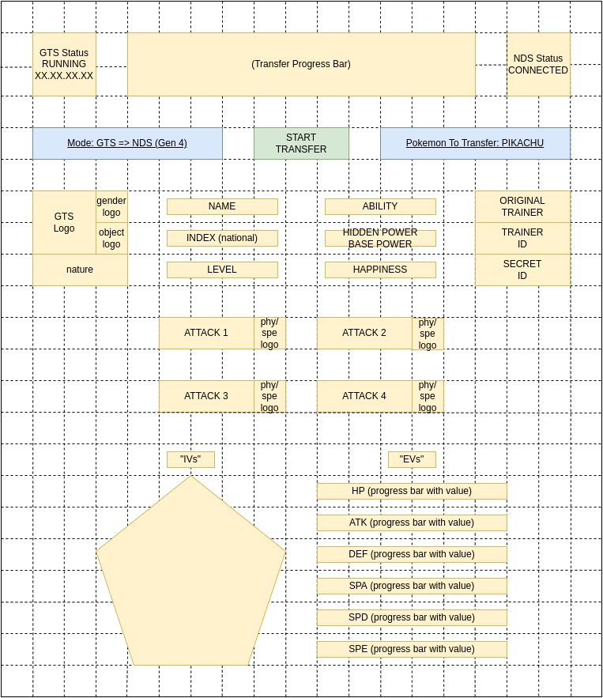

# GTS-FRONT
Frontend interface for the GTS service.

---

Mostly, it should receive data from the NDS, and send them, updated to it.

Eventually it must:
 - receive data events from the GTS service (using socket.io, or pure rest requests)
 - send data to the GTS service (rest request)

Flow:
 - sending pokemon to GTS:   NDS > gts-flat-pass > gts-service > gts-front
 - receive pokemon from GTS: gts-front > gts-service > gts-flat-pass > NDS

---

# Fake-GTS to NDS


---

# NDS to Fake-GTS
```
+-----------------------------------------------------------------------------+
|                                                                             |
|    Fake-GTS Status: Running on XX.XX.XX.XX         NDS Status: CONNECTED    |
|                                                                             | 
+-----------------------------------------------------------------------------+
|                                                                             |
|                                                                             |
|   Mode:  Fake-GTS => NDS (Gen4)                                             |
|          ----------------------                                             |
|                                                                             |
|   +------+ +----------------------------------------------------+ +------+  |
|   | GTS  | |/////////////////////////////////////////////       | | NDS  |  |
|   |      | |/////////////////////// 90% /////////////////       | |      |  |
|   | Logo | |/////////////////////////////////////////////       | | Logo |  |
|   +------+ +----------------------------------------------------+ +------+  |
|                                                                             |
|                                                                             |
|   Pokemon to Receive:  Pikachu (lvl.1 / rare-candy / timid)  <- - - - - - - - - - -  dropdown menu
|                        ------------------------------------                 |
|                                                                             |
|   +-------+                                                                 |
|   | Pkmn  |  Name:  Pikachu   Gender:  Male                                 |
|   |       |  Index: #25       Ability: Static                               |
|   | icon +-+ Level: 1         Nature:  Timid                                |
|   +------|O|                                                                |
|          +-+                                                                |
|                                                                             |
|    OT: B,  ID: 39771,  Secret ID: 39765                                     |
|    Holding: Rare Candy,  Happiness: 73                                      |
|    Hidden Power: Psychic-type, 42 Base Power                                |
|                                                                             |
|    Attacks: +------------+--------+                                         |
|             | Nasty Plot | Growl  |                                         |
|             +------------+--------+                                         |
|             | Charm      | Nuzzle |                                         |
|             +------------+--------+                                         |
|                                                                             |
|    IVs: HP  27, Atk  10, Def  13, SpA  28, SpD   7, Spe  25                 |
|    EVs: HP   0, Atk   0, Def   0, SpA   0, SpD   0, Spe   0, Total 0        |
|                                                                             |
|                                                                             |
+-----------------------------------------------------------------------------+

```
